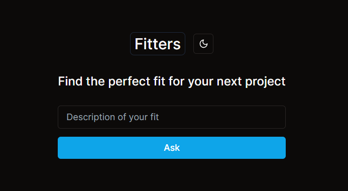

<!-- image fitters.png -->

# Fitters

Get the perfect fit for your next occasion.

## Table of Contents

- [Overview](#overview)
- [Getting Started](#getting-started)
  - [Prerequisites](#prerequisites)
  - [Installation](#installation)
  - [Running the Development Server](#running-the-development-server)
- [Usage](#usage)
- [Deployment](#deployment)
- [Built with](#built-with)
- [Contributing](#contributing)
- [License](#license)

## Overview

Have trouble finding your next outfit? Fitters is a web application that helps you find the perfect fit for your next occasion. Fitters is built with Next.js, React, and Tailwind CSS.

<!-- ## Features

List the key features and functionalities of your Next.js project. Bullet points work well for this section. -->

## Getting Started

Provide instructions for setting up the project locally.

`npm i`

it's that simple. 

### Prerequisites

Pre-requisites for running the project locally. For example:

- [Node.js](https://nodejs.org/en/)
- [Next.js](https://nextjs.org/)
- [Tailwind CSS](https://tailwindcss.com/)

### Running the Development Server

`npm run dev`

## Usage

Provide a brief description on the type clothing you want to wear and Fitters will provide you with a list of clothing that fits your description. 

The more specific you are, the better the results.

## Deployment

This project is deployed on netlify.

## Built with

List the technologies, frameworks, libraries, and tools used in your project. For example:

- [Next.js](https://nextjs.org/)
- [React](https://reactjs.org/)
- [Tailwind CSS](https://tailwindcss.com/)

## Contributing

Of course! Here's an example of how you can structure the "Contributing" section in your README:

## Contributing

We welcome contributions to improve and enhance Fitters. To contribute, please follow these steps:

1. Fork this repository.
2. Create a new branch: `git checkout -b feature/your-feature-name`.
3. Make your changes and commit them: `git commit -am 'Add some feature'`.
4. Push to the branch: `git push origin feature/your-feature-name`.
5. Create a pull request, explaining the changes you've made and why they should be merged.
6. After review and approval, your changes will be merged into the main repository.

### Issue Reporting

If you encounter any issues while using Fitters, please [open an issue](https://github.com/jessedoka/fitters/issues/new) on our GitHub repository. Provide as much detail as possible, including steps to reproduce the issue, expected behavior, and screenshots if applicable.

### Feature Requests

If you have a feature idea or enhancement you'd like to see in Fitters, please [open an issue](https://github.com/jessedoka/fitters/issues/new) with the "Feature Request" label. Describe the feature and its potential benefits.

We appreciate your contributions and effort to make Fitters better!

<!-- ## Acknowledgements

Mention any resources, inspirations, or third-party libraries that you'd like to acknowledge. -->

---